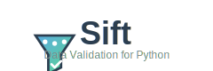

# Sift: Powerful Data Validation for Python

<div align="center">
  
  
  [](https://badge.fury.io/py/sift-validator)
  [](https://pypi.org/project/sift-validator/)
  [](https://opensource.org/licenses/MIT)
</div>

## Introduction

Sift is a robust, type-safe data validation library for Python, designed to make data validation straightforward yet powerful. Created by [techwithdunamix](https://github.com/techwithdunamix) and maintained by [Nexios Labs](https://github.com/nexios-labs), Sift provides a declarative API for defining validation schemas with comprehensive type hints.

### Key Features

- **Type-safe validation**: Utilizes Python's type hinting for intelligent validation
- **Composable validators**: Build complex schemas from simple, reusable components
- **Zero dependencies**: Core functionality has no external dependencies
- **Customizable error messages**: Clear, contextual error reporting
- **Optional and nullable fields**: First-class support for handling missing or null data
- **Async support**: Native async validation for high-performance applications
- **Framework integration**: Seamless integration with Nexios and other web frameworks

## Installation

```bash
pip install sift-validator
```

## Quick Start

Here's a simple example showing how to validate a user object:

```python
from sift import Object, String, Number, Boolean
from sift.validators.base import ValidationError

# Define a user schema
user_schema = Object({
    "username": String().min(3).max(50),
    "email": String().email(),
    "age": Number().int().min(18),
    "profile": Object({
        "bio": String().max(500).optional(),
        "is_public": Boolean().default(True)
    }).optional()
})

# Valid data
valid_user = {
    "username": "johndoe",
    "email": "john@example.com",
    "age": 25,
    "profile": {
        "bio": "Hello, I'm John!",
        "is_public": False
    }
}

# Validate the data
try:
    validated_user = user_schema.validate(valid_user)
    print("Validation successful:", validated_user)
except ValidationError as e:
    print("Validation failed:", e)
```
## Basic Usage

### Primitive Validators

#### String Validation

```python
from sift import String

# Basic string validation
String().validate("hello world")  # Returns: "hello world"

# Min/max length
String().min(5).validate("hello")  # OK
String().max(10).validate("hello")  # OK
String().min(10).validate("hello")  # ValidationError

# Pattern matching with regex
String().pattern(r"^\d{3}-\d{2}-\d{4}$").validate("123-45-6789")  # OK
String().pattern(r"^\d{3}-\d{2}-\d{4}$").validate("invalid")  # ValidationError

# Email validation
String().email().validate("user@example.com")  # OK
String().email().validate("not-an-email")  # ValidationError

# URL validation
String().url().validate("https://example.com")  # OK
String().url().validate("invalid-url")  # ValidationError

# Transformations
String().trim().validate("  hello  ")  # Returns: "hello"
String().lowercase().validate("HELLO")  # Returns: "hello"
String().uppercase().validate("hello")  # Returns: "HELLO"
```

#### Number Validation

```python
from sift import Number

# Basic number validation
Number().validate(42)  # Returns: 42
Number().validate(3.14)  # Returns: 3.14

# Integer validation
Number().int().validate(42)  # Returns: 42
Number().int().validate(3.14)  # ValidationError

# Range validation
Number().min(10).validate(42)  # OK
Number().max(50).validate(42)  # OK
Number().min(50).validate(42)  # ValidationError

# Positive/negative
Number().positive().validate(42)  # OK (number > 0)
Number().negative().validate(-42)  # OK (number < 0)

# Multiple of
Number().multiple_of(5).validate(10)  # OK (10 is multiple of 5)
Number().multiple_of(7).validate(10)  # ValidationError
```

#### Boolean Validation

```python
from sift import Boolean

# Basic boolean validation
Boolean().validate(True)  # Returns: True
Boolean().validate(False)  # Returns: False
Boolean().validate("true")  # ValidationError

# Truthy values (with conversion)
Boolean().truthy().validate(1)  # Returns: True
Boolean().truthy().validate("yes")  # Returns: True
Boolean().truthy().validate(0)  # Returns: False
Boolean().truthy().validate("no")  # Returns: False
```

### Collection Validators

#### Object Validation

```python
from sift import Object, String, Number

# Define an object schema
user_schema = Object({
    "username": String().min(3),
    "email": String().email(),
    "age": Number().int().min(18)
})

# Validate an object
valid_user = {"username": "johndoe", "email": "john@example.com", "age": 25}
user_schema.validate(valid_user)  # Returns the validated object

# Additional properties control
strict_schema = Object({
    "name": String(),
    "age": Number()
}).additional_properties(False)

strict_schema.validate({"name": "John", "age": 30})  # OK
strict_schema.validate({"name": "John", "age": 30, "extra": "field"})  # ValidationError

# Pattern properties
pattern_schema = Object({}).pattern_property(
    r"^meta_", String()  # All properties starting with "meta_" must be strings
)

pattern_schema.validate({
    "meta_title": "Hello",
    "meta_description": "World"
})  # OK
```

#### List Validation

```python
from sift import List, String, Number

# Basic list validation
List(String()).validate(["a", "b", "c"])  # OK
List(Number().int()).validate([1, 2, 3])  # OK

# Length constraints
List(String()).min(2).validate(["a", "b", "c"])  # OK
List(String()).max(5).validate(["a", "b", "c"])  # OK
List(String()).length(3).validate(["a", "b", "c"])  # OK

# Unique items
List(String()).unique().validate(["a", "b", "c"])  # OK
List(String()).unique().validate(["a", "b", "a"])  # ValidationError

# Non-empty lists
List(String()).nonempty().validate(["a"])  # OK
List(String()).nonempty().validate([])  # ValidationError
```

#### Dict Validation

```python
from sift import Dict, String, Number

# Open dictionary with any keys (but typed values)
Dict().additional_properties(String()).validate({
    "key1": "value1",
    "key2": "value2"
})  # OK

# Dictionary with specific schema
Dict({
    "name": String(),
    "age": Number().int()
}).validate({
    "name": "John",
    "age": 30
})  # OK

# Min/max properties
Dict().min_properties(2).validate({"a": 1, "b": 2})  # OK
Dict().max_properties(3).validate({"a": 1, "b": 2})  # OK
```

### Optional and Nullable Fields

Sift provides first-class support for handling optional (can be omitted) and nullable (can be explicitly `None`) fields:

```python
from sift import Object, String, Number

# Optional fields (can be omitted)
schema = Object({
    "required": String(),
    "optional": String().optional()
})

schema.validate({"required": "value"})  # OK - optional field is missing
schema.validate({"required": "value", "optional": "value"})  # OK
schema.validate({"required": "value", "optional": None})  # ValidationError - not nullable

# Nullable fields (can be None)
schema = Object({
    "required": String(),
    "nullable": String().nullable()
})

schema.validate({"required": "value", "nullable": None})  # OK - nullable field is None
schema.validate({"required": "value"})  # ValidationError - still required

# Both optional and nullable
schema = Object({
    "required": String(),
    "optional_nullable": String().optional().nullable()
})

schema.validate({"required": "value"})  # OK - field is optional
schema.validate({"required": "value", "optional_nullable": None})  # OK - field accepts None
schema.validate({"required": "value", "optional_nullable": "value"})  # OK
```

### Default Values

You can specify default values for optional fields:

```python
from sift import Object, String, Boolean, Number

schema = Object({
    "username": String(),
    "is_active": Boolean().optional().default(True),
    "score": Number().optional().default(lambda: 100)
})

# Default values are used when fields are missing
result = schema.validate({"username": "johndoe"})
print(result)  # {"username": "johndoe", "is_active": True, "score": 100}
```

## API Reference

### Base Validator Methods

All validator types inherit these methods:

| Method | Description |
|--------|-------------|
| `optional()` | Makes the field optional (can be omitted) |
| `nullable()` | Makes the field nullable (can be explicitly `None`) |
| `default(value)` | Sets a default value for optional fields |
| `error(message)` | Sets a custom error message |
| `validate(data)` | Validates data synchronously |
| `validate_async(data)` | Validates data asynchronously |

### Primitive Validators

#### String

| Method | Description |
|--------|-------------|
| `min(length)` | Minimum string length |
| `max(length)` | Maximum string length |
| `length(length)` | Exact string length |
| `pattern(regex)` | Regular expression pattern |
| `email()` | Validates as email address |
| `url()` | Validates as URL |
| `uuid()` | Validates as UUID |
| `datetime()` | Validates as ISO format datetime |
| `date()` | Validates as ISO format date |
| `trim()` | Trims whitespace from string |
| `lowercase()` | Converts string to lowercase |
| `uppercase()` | Converts string to uppercase |
| `nonempty()` | Requires non-empty string |

#### Number

| Method | Description |
|--------|-------------|
| `min(value)` | Minimum value |
| `max(value)` | Maximum value |
| `int()` | Must be an integer |
| `positive()` | Must be positive (> 0) |
| `negative()` | Must be negative (< 0) |
| `multiple_of(value)` | Must be a multiple of value |

#### Boolean

| Method | Description |
|--------|-------------|
| `truthy()` | Allows truthy/falsy values (converts to boolean) |

#### Any

Accepts any value type.

#### Null

Only accepts `None` values.

### Collection Validators

#### Object

| Method | Description |
|--------|-------------|
| `additional_properties(value)` | Controls additional properties (True, False, or validator) |
| `pattern_property(pattern, validator)` | Adds validation for properties matching a pattern |
| `required(*keys)` | Specifies which keys are required |
| `min_properties(count)` | Minimum number of properties |
| `max_properties(count)` | Maximum number of properties |

#### List

| Method | Description |
|--------|-------------|
| `min(length)` | Minimum list length |
| `max(length)` | Maximum list length |
| `length(length)` | Exact list length |
| `unique()` | Requires all items to be unique |
| `nonempty()` | Requires at least one item |

#### Dict

| Method | Description |
|--------|-------------|
| `additional_properties(value)` | Controls additional properties (True, False, or validator) |
| `pattern_property(pattern, validator)` | Adds validation for properties matching a pattern |
| `required(*keys)` | Specifies which keys are required |
| `min_properties(count)` | Minimum number of properties |
| `max_properties(count)` | Maximum number of properties |

#### Tuple

| Method | Description |
|--------|-------------|
| `min(length)` | Minimum tuple length |
| `max(length)` | Maximum tuple length (with rest validator) |

#### Union

| Method | Description |
|--------|-------------|
| `discriminator_mapping(mapping)` | Maps discriminator values to validators |

## Advanced Usage

### Custom Validators

You can create custom validators by extending the `Validator` base class:

```python
from sift.validators.base import Validator, ValidationError
from typing import Any, List

class EvenNumberValidator(Validator[int, int]):
    def _validate(self, data: Any, path: List[str]) -> int:
        if not isinstance(data, int):
            raise ValidationError(
                self._get_error_message(f"Expected integer, got {type(data).__name__}"),
                path
            )
        
        if data % 2 != 0:
            raise ValidationError(
                self._get_error_message("Number must be even"),
                path
            )
            
        return data

# Usage
even_validator = EvenNumberValidator()
even_validator.validate(2)  # OK
even_validator.validate(3)  # ValidationError: Number must be even
```

### Asynchronous Validation

Sift supports asynchronous validation for high-performance applications:

```python
import asyncio
from sift import Object, String, Number

async def validate_user():
    schema = Object({
        "username": String().min(3),
        "age": Number().int().min(18)
    })
    
    data = {"username": "johndoe", "age": 25}
    result = await schema.validate_async(data)
    return result

# Run the async validation
result = asyncio.run(validate_user())
```

For custom async validators:

```python
from sift.validators.base import Validator, ValidationError
import asyncio

class AsyncValidator(Validator):
    async def _validate_async(self, data, path):
        # Simulate async operation
        await asyncio.sleep(0.1)
        
        if not self._is_valid(data):
            raise ValidationError("Invalid data", path)
            
        return data
        
    def _is_valid(self, data):
        # Your validation logic here
        return True
```

### Data Transformation

You can use Sift to not only validate but also transform data:

```python
from sift import Object, String, Number

# Transform user data
user_schema = Object({
    "name": String().trim().uppercase(),
    "username": String().trim().lowercase(),
    "age": Number().int()  # Converts float to int if possible
})

data = {
    "name": "  John Doe  ",
    "username": "  JohnD  ",
    "age": 30.0
}

result = user_schema.validate(data)
print(result)
# {"name": "JOHN DOE", "username": "johnd", "age": 30}
```

## Framework Integration

Sift integrates seamlessly with various web frameworks, particularly with [Nexios](https://nexios.io), the ASGI framework developed by the same team.

### Integration with Nexios

Sift is the default validation library for [Nexios](https://nexios.io/docs/validation), enabling robust request and response validation with minimal boilerplate:

```python
from nexios import get_application
from nexios.http import  Request, endpoints
from sift import Object, String, Number
from sift.validators.base import ValidationError
# Define validation schema
UserSchema = Object({
    "username": String().min(3).max(50),
    "email": String().email(),
    "age": Number().int().min(18)
})

app = get_application()

@app.post("/users")
async def create_user(request :Request, response :Response):
    # Validate request body against schema
    try:
        data = await request.json
        validated_data = UserSchema.validate(data)
        # Attach validated data to request
        request.state.validated_data = validated_data
    except ValidationError as e:
        return res.json(e, status = 422)
    username = user_data["username"]
    email = user_data["email"]
    
    # Process the validated data...
    return res.json({"status": "success", "message": f"User {username} created"})
```


## OpenAPI Integration

Sift provides tools for generating OpenAPI schema definitions from your validation schemas, making it easy to document your API.

### Generating OpenAPI Schemas

```python
from sift import String, Number, Object, List, Boolean
from sift.openapi import generate_openapi_schema

# Define a validation schema
user_schema = Object({
    "id": Number().int().positive(),
    "username": String().min(3).max(20),
    "email": String().email(),
    "is_active": Boolean().default(True),
    "tags": List(String()).optional(),
    "profile": Object({
        "full_name": String().optional(),
        "bio": String().max(500).optional()
    }).optional()
})

# Generate OpenAPI schema
openapi_schema = generate_openapi_schema(user_schema)

# The result is a dict compatible with OpenAPI 3.0
print(openapi_schema)
```

Example output:

```json
{
  "type": "object",
  "properties": {
    "id": {
      "type": "integer",
      "minimum": 0
    },
    "username": {
      "type": "string",
      "minLength": 3,
      "maxLength": 20
    },
    "email": {
      "type": "string",
      "format": "email"
    },
    "is_active": {
      "type": "boolean",
      "default": true
    },
    "tags": {
      "type": "array",
      "items": {
        "type": "string"
      }
    },
    "profile": {
      "type": "object",
      "properties": {
        "full_name": {
          "type": "string"
        },
        "bio": {
          "type": "string",
          "maxLength": 500
        }
      }
    }
  },
  "required": ["id", "username", "email", "is_active"]
}
```


## Contributing

Contributions to Sift are welcome! Here's how you can contribute:

### Development Setup

1. Clone the repository:
   ```bash
   git clone https://github.com/nexios/sift.git
   cd sift
   ```

2. Create a virtual environment and install dependencies:
   ```bash
   python -m venv venv
   source venv/bin/activate  # On Windows, use: venv\Scripts\activate
   pip install -e ".[dev]"
   ```

3. Run tests:
   ```bash
   pytest
   ```

### Contributing Guidelines

1. **Bug Reports**: Please use the issue tracker to report bugs, including a minimal reproducible example.

2. **Feature Requests**: Open an issue describing the feature and its use case.

3. **Pull Requests**:
   - Fork the repository
   - Create a new branch for your feature or bugfix
   - Add tests for your changes
   - Update documentation as needed
   - Submit a pull request

4. **Code Style**: Follow PEP 8 guidelines. Run the linter before submitting:
   ```bash
   flake8 sift
   ```

5. **Documentation**: Update the documentation when adding or modifying features.

### Code of Conduct

We expect all contributors to be respectful and considerate of others. Please report any unacceptable behavior to the project maintainers.

## License

Sift is licensed under the MIT License. See the [LICENSE](LICENSE) file for details.

## Acknowledgements

Sift is created and maintained byCreated by [techwithdunamix](https://github.com/techwithdunamix) and maintained by [Nexios Labs](https://github.com/nexios-labs). Special thanks to all contributors who have helped make Sift better.

